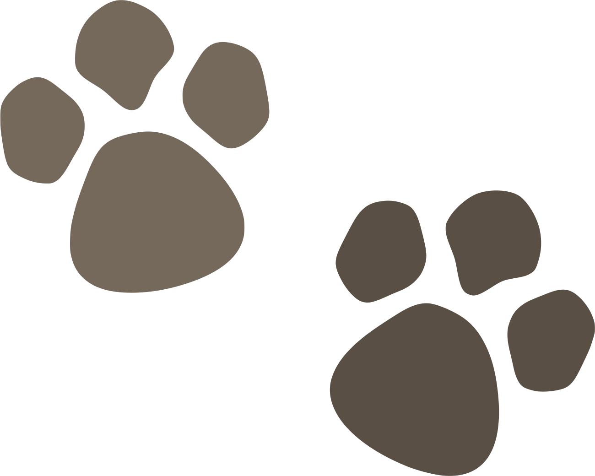

<div align="center">
  
</div>

# Traceback
[](https://github.com/loilo/traceback/actions)
[](https://packagist.org/packages/loilo/traceback)

Get the file or directory calling your code.

## Installation
```bash
composer require loilo/traceback
```

## Usage
`/var/www/foo.php`
```php
require_once __DIR__ . '/vendor/autoload.php';

use Loilo\Traceback\Traceback;

function foo()
{
    var_dump(
        // File path calling foo()
        Traceback::file(),

        // Directory of file calling foo()
        Traceback::dir(),

        // File path calling foo() but skipping
        // the first file in the chain
        Traceback::file(1),

        // Directory of file calling foo() with skipping
        Traceback::dir(1)
    );
}
```

`/var/www/bar.php`
```php
require_once __DIR__ . '/foo.php';

foo();
```

`/var/www/baz/qux.php`
```php
require_once __DIR__ . '/../bar.php';
```

Running `qux.php` will output:
```
string(16) "/var/www/bar.php"
string(8) "/var/www"
string(20) "/var/www/baz/qux.php"
string(12) "/var/www/baz"
```
